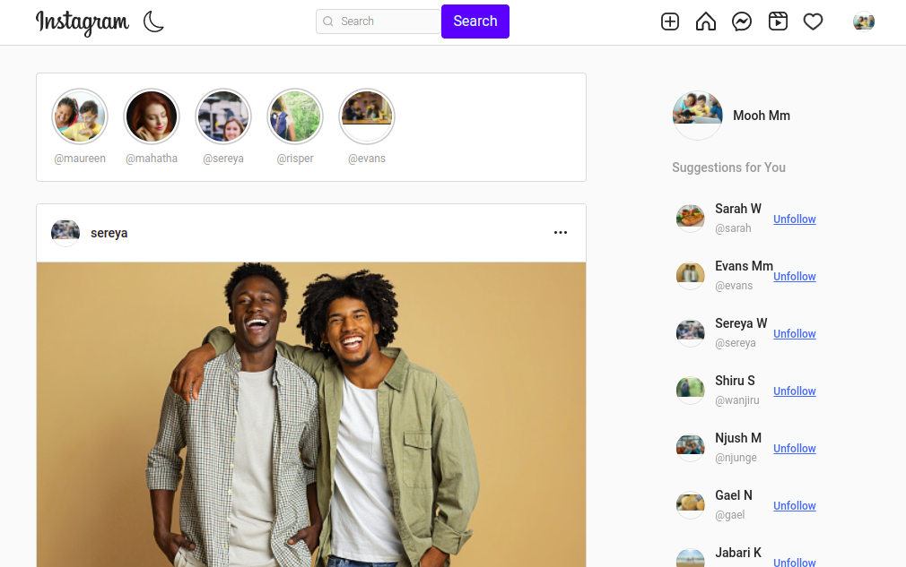
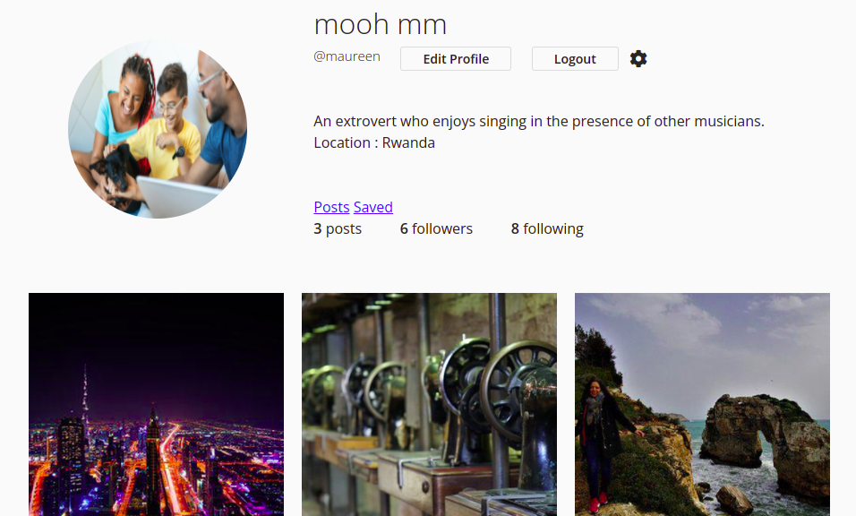
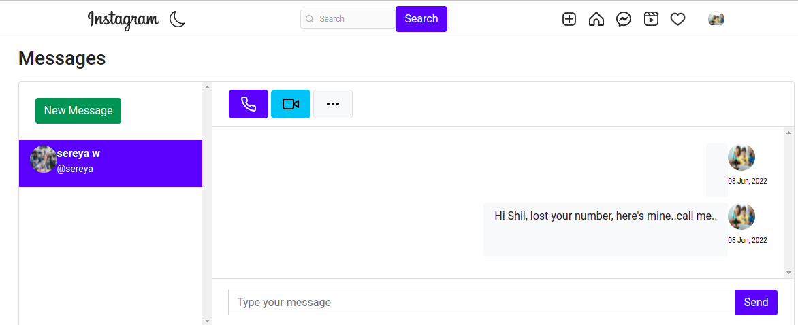
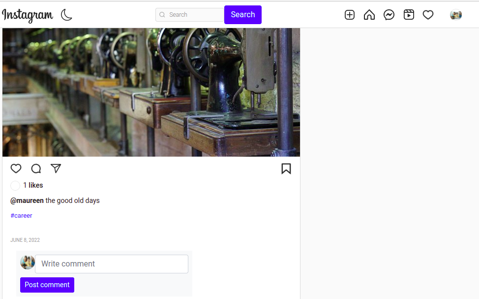
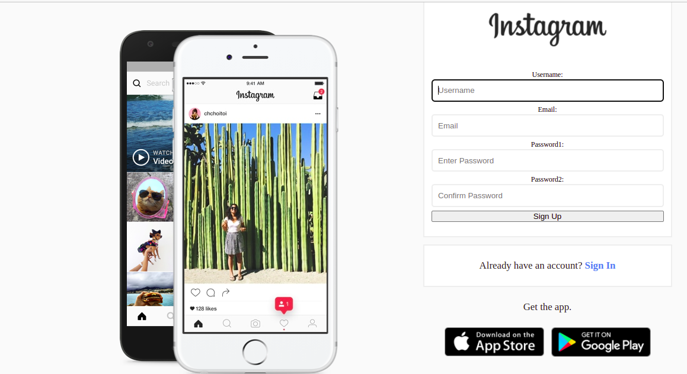
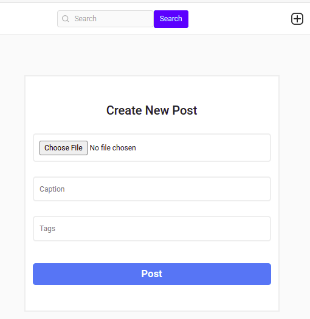

  **Sneakpeak**

Instapics is a Photos application showcasing a collection of posts from different users. Users get to sign in/sign up, follow others , add their own pictures as well as like and comment on posts on their feed.

  **Project description**

Users get to view photos uploaded by followers as well as their own.

Users can view and edit their profile information.

Users can search users and send out private messages to other users.

Users can comment and like posts on their feed

  **BDD**

Click on the project link and sign up, if an already existing user then sign in.

Edit your profile by addig profile picture, name, bio and address.

Follow other users ,comment and like posts that interest you, and send provate messages to users.

Add as many post as you would like 

  **Getting Started**

To clone the repository, run:

git clone https://github.com/MugureNjunge/instapics

Then navigating to the cloned directory:

cd instapics

  **Requirements**

The Instapics app requires one to understand :

Django Framework

Python3.8

Postgres

Virtual environment

  **Setup and installation**

Install and activate virtual environment

Install dependancies

Create the Database

- psql

- CREATE DATABASE <name>

Create .env file

  **Run initial Migration**

python3.8 manage.py makemigrations <do this for all apps in project>

python3.8 manage.py migrate

  **Run the application**

python3.8 manage.py runserver

Follow link provided after running to open app on local host:8000

  **Deployment**

The application is deployed on Heroku and is live on this link: 

  **Built With/Technologies**

Django 4 - Back end logic

Bootstrap - Application design

Pillow - Upload images

  **Contact:**

Incase of any question or contributions, you can contact me through: maureen.njunge@student.moringaschool.com

  **License**

This project is licensed under the terms of the MIT license

  **Copyright (c) 2022 Mugure Njung'e**

